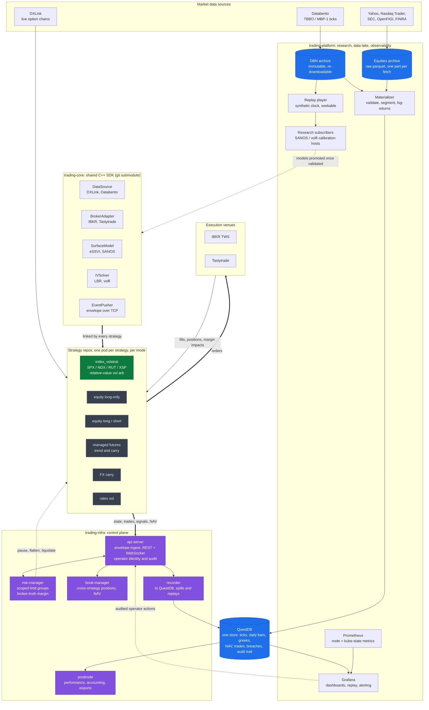
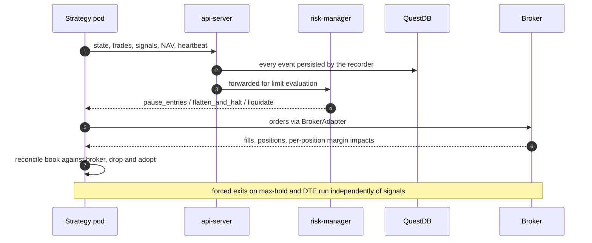

## Hi, I'm Marwin 👋

I'm a finance graduate from [Bayes Business School](https://www.bayes.city.ac.uk/) (BSc Investment & Financial Risk Management, Top Decile) with experience in data engineering, systematic trading, and derivatives research. If it's convex and complex, I'm interested!

Right now, I'm building data and execution infrastructure for systematic trading in C++ and continuing my research in the relative-value volatility space.

Currently forward-testing three quirky volatility statistical arbitrage edges in index vol. All of them (combined) lead to market-neutral returns.

### Previous roles:
- Data Engineer at Swiss Re
- Summer Intern at Swiss Life Asset Managers
- Spring Insight at Barclays

### What I'm thinking about

A few threads I'm currently pulling on:

- **Building volatility surfaces.** In my bachelor's thesis, I focused on volatility statistical arbitrage. To define fair value in the $\mathbb{Q}$ domain, you need an IV parametrisation. The tooling I built for this is now [`pysvi`](https://github.com/marwinsteiner/pysvi) , an open-source Python library on PyPI. 
- **Event-driven & prediction markets.** I've been building automated trading infrastructure for [Polymarket](https://github.com/marwinsteiner/polymarket-bot). In my view, prediction markets are one of the most interesting laboratories for testing probabilistic reasoning under uncertainty.
- **Longhand.** I did not like existing $\LaTeX$ editors, so I created my own research workspace: [Longhand.dev](https://www.longhand.dev)
- **HKJC API.** As a transient interest, I wrote a scraper for and strung an API around the Hong Kong Jockey Club website, allowing retrieval of historic race and form data because I did not want to pay for existing services. The goal was to use machine learning to identify consistent race winners. This research is not publicly available.

### Paper Abstracts
_Title: Mean Reversion in the Intraday Implied Volatility Surface of S&P 500 Options_

We study intraday S&P 500 index option implied volatilities using an extended stochastic
volatility-inspired parametrisation, recalibrated jointly across all expiries at 60-second inter
vals over 63 trading days. Two experiments are conducted. The first decomposes the recon
structed implied volatility surface via functional principal component analysis, fits a vector
autoregression to the resulting factor scores, and tests whether the surface-level forecast can
outperform a random walk. The second measures the basis between each quoted implied
volatility and the fitted surface, tests for serial dependence, and assesses the economic scale
of the resulting deviations against the bid–ask spread.

_Title: Reverse-Engineering a Dominant Market Maker from Level 4 Order Book Data (ongoing)_

Avellaneda and Stoikov's definition of market making as a stochastic optimal control problem is one of the seminal works in the academic study of market making. However, testing whether a large liquidity provider actually follows this method requires detailed order book data, not commonly disseminated by traditional financial exchanges. Recently, a Level 4 order book dataset from the perpetual futures exchange Hyperliquid was published, for the first time allowing us to pose the question whether any large market makers actually use this model. We identify the largest market maker by traded- against resting notional, reconstructing its quotes, quoting ladder, and inventory every second. Arrival intensities are estimated from the wallet's own resting orders by censored Poisson maximum likelihood estimation. We find the wallet's quoting mostly inconsistent with the model tested. 

### My Systematic Trading Setup

Most of my time goes into a systematic trading system that runs end-to-end on a local Kubernetes cluster: research, calibration, execution, risk, reconciliation and post-trade accounting. It is split into three repositories so that a new strategy is a *new pod*, not a new system.

- **`trading-core`**: a shared C++ SDK, consumed as a git submodule. It owns the pluggable interfaces (market data, broker, volatility surface, IV solver) and the event envelope every pod speaks. Strategies depend on interfaces, never on a vendor.
- **`trading-infra`**: the control plane. Ingests every pod's events over a length-prefixed TCP envelope, enforces risk limits against *broker-truth* margin, aggregates the cross-strategy book, records everything, and runs post-trade reporting.
- **`trading-platform`**: research and observability. An immutable tick/bar archive, a materializer into QuestDB, a seekable replay engine for what-if calibration, and Grafana for dashboards, alerting and audited operator actions.

Green: built and running. Dashed grey: not built yet.

**How a strategy slots in.** Every pod, whatever it trades, speaks one protocol and inherits risk, recording, reconciliation and reporting for free:

### Toolbox

